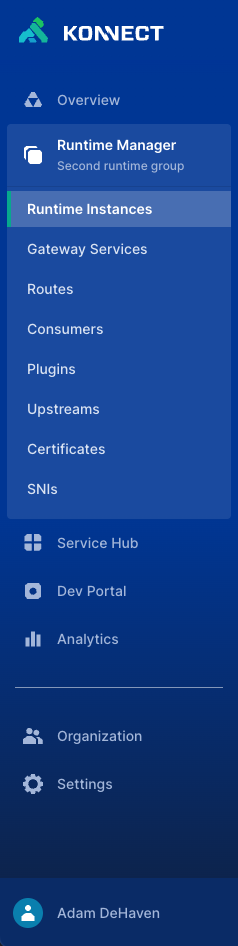

# @kong-ui/sidebar

> **NOTE**: Docs are a work-in-progress

A Kong UI dynamic sidebar component.

- [Features](#features)
- [Requirements](#requirements)
- [Usage](#usage)
  - [Install](#install)
  - [Usage Example](#usage-example)
- [Props](#props)
  - [`topItems`](#topitems)
  - [`bottomItems`](#bottomitems)
  - [`profileItems`](#profileitems)
  - [`profileName`](#profilename)
  - [`headerHeight`](#headerheight)
- [TypeScript interfaces](#typescript-interfaces)

## Features

- Reactive updates based on `prop` value changes :rocket:
- Completely customizable L1 and L2 navigation items
- Built-in support for user Profile (in the sidebar footer) and profile dropdown items
- Navigate via `<router-link>` in your host application, or provide regular URLs :link:
- Slottable `header` area for displaying the host application logo



## Requirements

- `vue` and `vue-router` must be initialized in the host application
- `@kong/kongponents` must be available in the host application, along with the package style imports. [See here for instructions on installing Kongponents](https://kongponents.konghq.com/#globally-install-all-kongponents). Specifically, the following Kongponents must be registered and globally available in the host application:
  - `KDropdownItem`
  - `KDropdownMenu`
  - `KIcon`
  - `KTooltip`
- If L2 sidebar items have required `route.params` in their route, they must be properly declared in the `item.to` property. Example:

    ```ts
    // Note: `currentRoute` equates to router.currentRoute and must be passed in to the consuming app's route generator
    {
      name: 'Runtime Manager',
      key: 'runtime-manager',
      to: { name: 'runtime-manager' },
      icon: 'runtimes',
      // Require the 'runtime-manager' page to be active and expanded to render the L2 items
      items: active('runtime-manager') && !!String(currentRoute?.params.control_plane_id || '') && [
        {
          name: 'Runtime Instances',
          to: {
            name: 'runtime-instances',
            // Required route params MUST be declared
            params: {
              control_plane_id: currentRoute?.params.control_plane_id
            }
          },
      ],
    },
    ```

## Usage

### Install

Install the component in your host application

```sh
yarn add @kong-ui/sidebar
```

### Usage Example

You will likely want to utilize a wrapper component in your application, so import the `SidebarNav` component and the package styles into your wrapper component.

You will also need to utilize a factory function (e.g. a composable) in order to generate and update your menu items.

<details>

<summary>:sparkles: Click to view the expanded usage example :sparkles:</summary>

#### `SidebarWrapper.vue`

```html
<template>
  <SidebarNav
    :header-height="60"
    :top-items="topItems"
    :bottom-items="bottomItems"
    :profile-items="profileItems"
    profile-name="Marty McFly"
    @click="activateSidebarItem"
  >
    <template #header>
      <div class="d-flex w-100 align-items-center">
        <router-link
            class="d-flex align-items-center w-100"
            :to="{ name: 'home' }"
          >
          This is my logo
        </router-link>
      </div>
    </template>
  </SidebarNav>
</template>

<script setup lang="ts">
import { watch, onBeforeMount } from 'vue'
// SidebarNav Component and types
import { SidebarNav, SidebarPrimaryItem, SidebarSecondaryItem, SidebarProfileItem } from '@kong-ui/sidebar'
import { RouteRecordRedirectOption, useRoute, useRouter } from 'vue-router'
import useSidebar from '../composables/useSidebar'
// Sidebar component styles
import '@kong-ui/sidebar/dist/style.css'

const { updateMenu, topItems, bottomItems, profileItems } = composables.useSidebar()
const router = useRouter()
const route = useRoute()

// Update the sidebar menu when the route.path changes
watch(
  () => route.path,
  (newPath, oldPath) => {
    // If the path didn't change, there's no need to refresh the nav
    if (newPath !== oldPath) {
      // Important: Update up the menu to properly render the sidebar items on route change
      updateMenu(route)
    }
  },
)

const activateSidebarItem = (item: SidebarPrimaryItem | SidebarSecondaryItem | SidebarProfileItem) => {
  if (typeof item?.to === 'object') {
    try {
      // Try to resolve the route based on the `item.to` property.
      // If unsuccessful, the catch will fire and we will fallback to allowing the `route.path` watcher handle the update
      const clickedRoute = router.resolve(item.to)

      // Get the full clickedRoute route config (to check its `redirect` property)
      const redirect: RouteRecordRedirectOption | undefined = router.getRoutes().find(route => route.name === clickedRoute.name)?.redirect

      let shouldUpdateMenu = true

      if (typeof redirect === 'object') {
        // If `redirect` is an object and the clickedRoute.name is the same as the redirect.name, return false to prevent updating the menu
        shouldUpdateMenu = (redirect as Record<string, any>).name && (redirect as Record<string, any>).name !== router.currentRoute.value.name
      } else if (typeof redirect === 'string') {
        // If `redirect` is a string and the clickedRoute.name is the same as the redirect (string, which is likely the route name), return false to prevent updating the menu
        shouldUpdateMenu = redirect !== router.currentRoute.value.name
      }

      // If a redirect property exists
      if (shouldUpdateMenu) {
        // Pass true here to allow for the route change to still be evaluated
        updateMenu(clickedRoute)
      }
    } catch (err) {
      // do nothing, fallback to the `route.path` watcher to update the menu
    }
  }
}

onBeforeMount(() => {
  updateMenu(route)
})
</script>
```

#### `useSidebar.ts`

```ts
import { ref } from 'vue'
import { SidebarPrimaryItem, SidebarProfileItem } from '@kong-ui/sidebar'
import { RouteLocationNormalizedLoaded } from 'vue-router'

export const useSidebar = () => {
  const topItems = ref<SidebarPrimaryItem[]>([])
  const bottomItems = ref<SidebarPrimaryItem[]>([])
  const profileItems = ref<SidebarProfileItem[]>([])

  const updateMenu = (currentRoute?: RouteLocationNormalizedLoaded) => {
    // Determine if the sidebar item is active if any matched route.name evaluates to the `routeName` string passed
    const active = (routeName: string): boolean => !!currentRoute?.matched.some(({ name }) => name === routeName)

    topItems.value = [
      {
        name: 'Organizations',
        key: 'organizations',
        to: { name: 'organizations' },
        active: active('root-organizations'), // L1 active() name must point to the root parent
        icon: 'organizations',
      },
      {
        name: 'Users',
        key: 'users',
        to: { name: 'users' },
        active: active('root-users'), // L1 active() name must point to the root parent
        icon: 'profile',
      },
      {
        name: 'Control Planes',
        key: 'control-planes',
        to: { name: 'control-planes' },
        active: active('root-control-planes'), // L1 active() name must point to the root parent
        icon: 'workspaces',
      },
    ]

    // In the future, update the bottomItems and profileItems here as needed
  }

  return {
    updateMenu,
    topItems,
    bottomItems,
    profileItems,
  }
}
```

</details>

## Props

### `topItems`

- type: `Array as PropType<SidebarPrimaryItem[]>`
- required: `false`
- default: `[]`

An array of `SidebarPrimaryItem` objects to display in the top navigation list (above the divider).

### `bottomItems`

- type: `Array as PropType<SidebarPrimaryItem[]>`
- required: `false`
- default: `[]`

An array of `SidebarPrimaryItem` objects to display in the bottom navigation list (below the divider).

### `profileItems`

- type: `Array as PropType<SidebarProfileItem[]>`
- required: `false`
- default: `[]`

An array of `SidebarProfileItem` objects to display in the sidebar footer profile popup menu.

### `profileName`

- type: `string`
- required: `false`
- default: `''`

A string to display in the sidebar footer profile area.

### `headerHeight`

- type: `number`
- required: `false`
- default: `60`

The height of the sidebar `header` slot, in pixels.

The `headerHeight` should be set to the same height as the host application's navbar element, if applicable.

## TypeScript interfaces

TypeScript interfaces [are available here](https://github.com/Kong/ui-shared-components/blob/main/packages/sidebar/src/types/index.ts) and can be directly imported into your host application. The following type interfaces are available for import:

```ts
import type { SidebarPrimaryItem, SidebarSecondaryItem, SidebarProfileItem } from '@kong-ui/sidebar'
```
